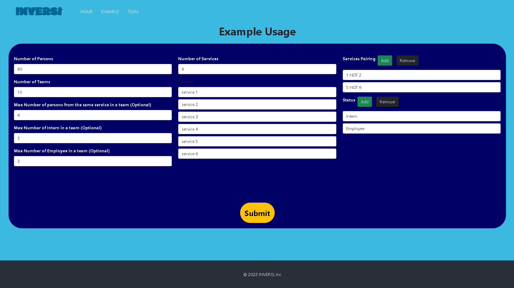
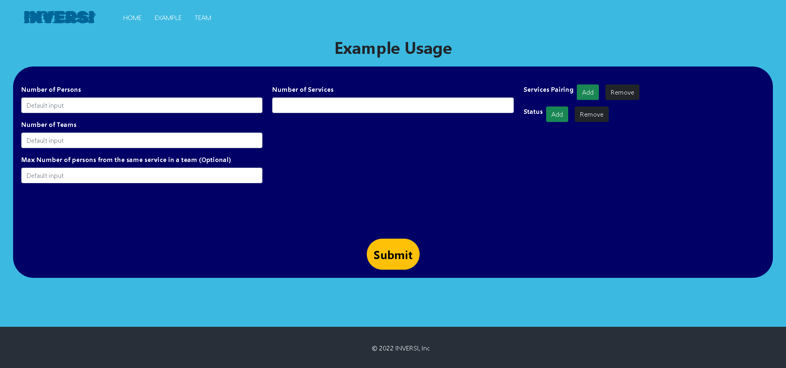
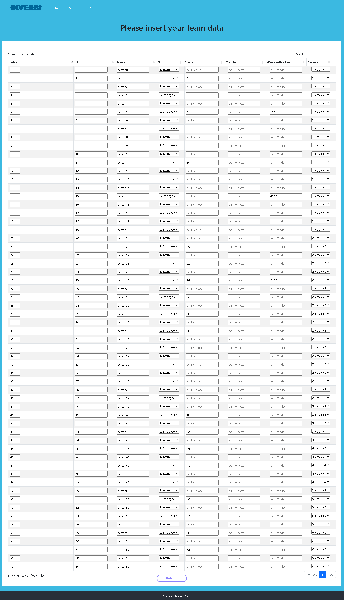
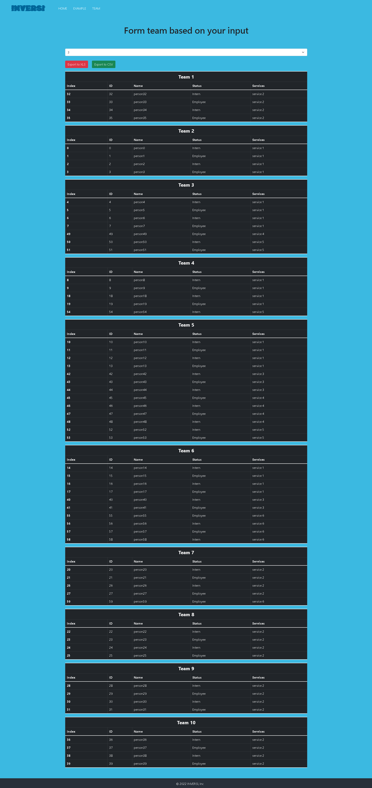

# team-building-minizinc

Our minizinc project code is based on code from http://www.hakank.org/minizinc/teambuilding.mzn.
We create a website using flask library from python version 3.8.x and constraint program using minizinc version 2.6.4.

In our website to see how you can create your own team, first try see our example page for easier understanding. As for those who still has trouble, this is the step to create your own team: 
1. go to team page 
2. fill the form 
3. click submit
4. fill the form-table
5. click submit again
6. result will be shown and you can choose 1 solution/combination of team out of one or more solutions given 
7. (optional) you can then choose to save the desired solution in .xlsx or .csv

Our website front-end:

